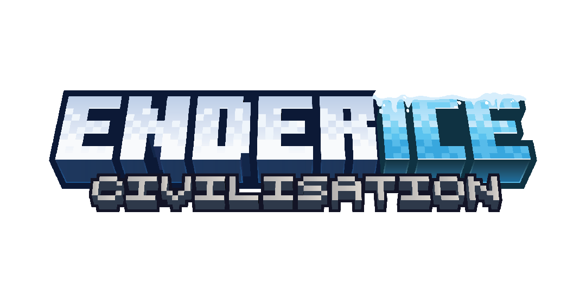

### Introduction
The Enderice Civilisation mod for Minecraft immerses players in the rich history of humankind, from the early use of fire to the colonization of other planets. This mod offers a unique and engaging gaming experience as players explore different eras and environments, from prehistory to a future where humans have reached the stars. Experience humanity's journey from their planet of origin as they establish colonies across the galaxy and discover the advancements that led to a multiplanetary civilisation.

### Download
### License & Credits
Read more in the [LICENSE](/LICENSE.md)
